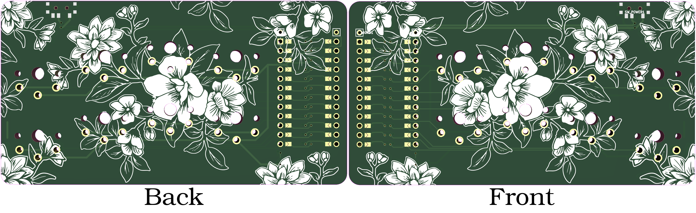
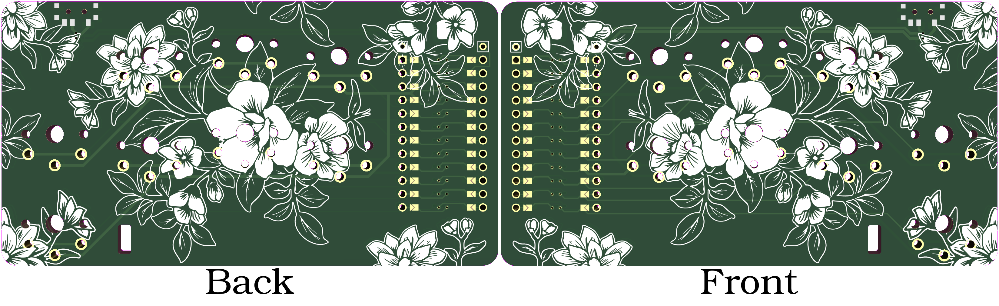

# The Paintbrush

A small keyboard design for those who cannot or prefer not use 'traditional' keyboard designs.

*This project aims to create a small keyboard design that is adaptable and flexible. Especially for those with disabilities, those who cannot type on traditional keyboards and those that prefer not use traditional keyboards.*

## Features
= *Reversible* PCB.
  * Can be built left *OR* right handed
+ Pro Micro/Nice!nano compatible MCU foot print.
= Kalih Choc v1 mechanical switches
  - Soldered directly; no hot swap sockets for you.
= Slide switch that can be used as a power switch.

### Changes from the original V4
- No Bottom plate.
- No OLED support.
- No hot swap socket pads.
+ Changed original messy footprint for the microcontroller for a nicer reversible one.
+ Added battery mounting pads for the nice!nano.
+ Added a small hole for a elastic band to "wear" the keyboard (mostly for the aggressive version).

## Versions

They are two version. The normal one based on the original paintbrush V4, and a modified one

*Please refer to the version folders for additional details on building as well as bill of materials.*

## What
A small keyboard hardware design that can be built free of charge for non-commercial use. The design is meant to be used with systems like [ARTSEY.IO](https://www.artsey.io/).

We also work to have our hardware supported by well known open source keyboard firmware projects to make them easier to setup and use.

## Why

There are few keyboard options for those with hand disabilities. The few commercial keyboards 'designed' to address hand disabilities are incredibly expensive and aren't well designed if you consider risk of long term RSI related problems. This project was founded to address these systemic issues.

## Who

Just a human who has had their left hand immobilized for 6 weeks and their right hand injured badly enough to cause typing problems on traditional keyboards for 2 weeks.

## Licensing

Unless otherwise stated all source code is licensed under the [Apache 2 License](LICENSE-APACHE-2.0.txt).

Unless otherwise state all hardware designs are licensed under the [CERN Open Hardware Licence Version 2 - Weakly Reciprocal License](LICENSE-cern_ohl_w_v2.txt).

Unless otherwise stated the non source code and non hardware design contents of this repository are licensed under a [Creative Commons Attribution-NonCommercial-ShareAlike 4.0 International License](LICENSE-CC-Attribution-NonCommercial-ShareAlike-4.0-International.txt)

## Commercial Licencing

If you're interested in commercial licencing of our designs, please contact KemoNine for details. Their e-mail can be found in the git log. When contacting KemoNine please include (at a minimum) your name, your company/store's website, how you plan to sell the designs and why you'd like to sell the designs.

*Please note: this applies to ANY sales that are not 'at cost' or would result in a profit (online stores, group buys, sales to friends, etc)*

## Bill of Materials
Please note: the provided links are for reference. Most of these products can be found in more than one store.

| Component | Part Information | Quantity | Purchase |
| --------- | ---------------- | -------- | -------- |
| Pro Micro MCU | Any pro micro compatible MCU that supports ZMK or QMK | 1 | N/A |
| Kalih Choc v1 Switches | Kailh low profile Switch 1350 Chocolate Keyboard Switch | 8 | [AliExpress](https://www.aliexpress.com/item/32959996455.html) |
| Optional Reset button | Omron Electronics Inc-EMC Div B3U-1000P | 1 | [DigiKey](https://www.digikey.com/en/products/detail/omron-electronics-inc-emc-div/B3U-1000P/1534338) |
| Optional Battery | A *lithium* battery for powering the board, we recommend 10440 or lithium polymer batteries | 1 |  |
| Rubber feet | For stability on a desk setting (mouse pad hack also works) | 1 | N/A |

## Firmware

QMK and ZMK reference code can be found at [qmk-artsey](https://github.com/artseyio/qmk-artsey/) and [zmk-artsey](https://github.com/artseyio/zmk-artsey/) respectively.

## PCB/Plate Ordering

### PCB
If you'd like to order a PCB you'll need either the main KiCAD file (the ones ending in .pro) or the gerber files (the zip files in the gerber folders). Most PCB makers will ask for gerber files which will be the zip files in the appropriate gerber folder. In each hardware revision's folder there will be bottom plate PCB files (KiCAD and gerber) as well as the main PCB files (KiCAD and gerber).

We have been able to confirm both [OSH Park](https://oshpark.com/) and [JLCPCB](https://jlcpcb.com/) can make the paintbrush PCBs.

JLCPCB is usually pretty cheap, even with a minimum order quanity of 5 PCBs. In many cases you can get 5 paintbrush PCBs for under $10 USD if you don't select super fast service or additional options.

